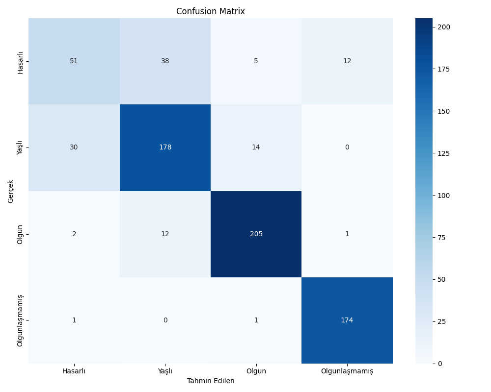
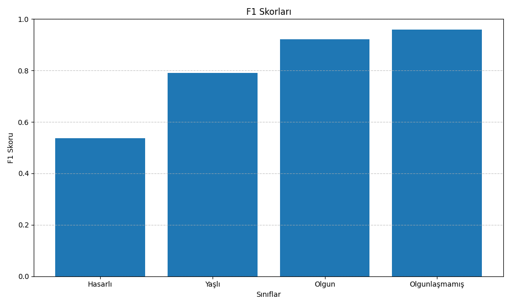
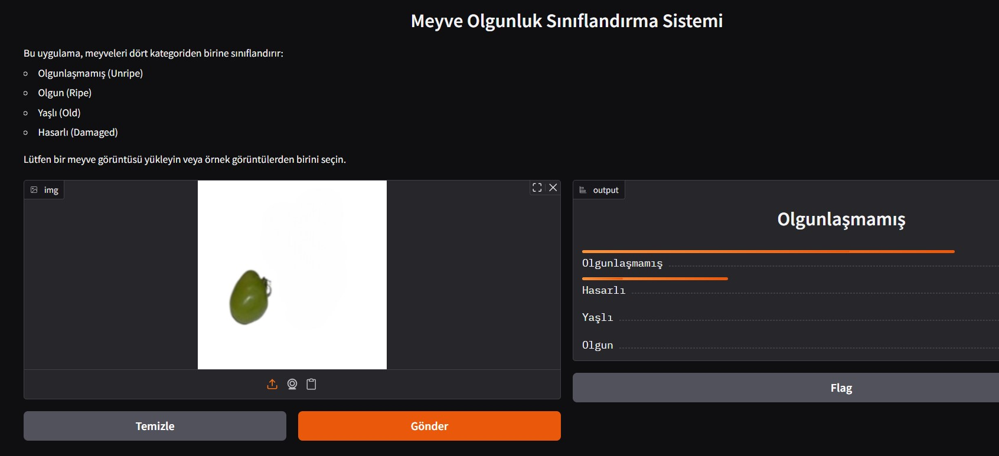

# Meyve Olgunluk Sınıflandırma Sistemi

Bu proje, meyveleri olgunluk durumuna göre sınıflandıran bir yapay zeka modelini içermektedir. Model, görüntülerden meyvelerin aşağıdaki dört kategoriden hangisine ait olduğunu tahmin eder:

- **Olgunlaşmamış (Unripe)**: Henüz olgunlaşmamış meyveler
- **Olgun (Ripe)**: Tüketim için ideal olgunluktaki meyveler
- **Yaşlı (Old)**: Aşırı olgunlaşmış meyveler
- **Hasarlı (Damaged)**: Çürük veya hasarlı meyveler

## Kurulum

1. Gerekli kütüphaneleri kurun:
   ```
   pip install -r requirements.txt
   ```

2. Veri setinin doğru konumda olduğundan emin olun:
   - `content/ieee-mbl-cls/train/` klasöründe eğitim verileri (Unripe, Ripe, Old, Damaged alt klasörleri)
   - `content/ieee-mbl-cls/val/` klasöründe doğrulama verileri (Unripe, Ripe, Old, Damaged alt klasörleri)

## Kullanım

### Modeli Eğitme

Modeli eğitmek için aşağıdaki komutu çalıştırın:

```
python egitim.py
```

Bu komut:
- Veri setini yükler ve ön işleme uygular
- CNN modelini oluşturur
- Modeli 10 epoch boyunca eğitir
- En iyi modeli `meyve_siniflandirma_modeli.h5` olarak kaydeder
- Sınıf isimlerini `sinif_isimleri.json` olarak kaydeder
- Eğitim metriklerini gösteren bir grafik oluşturur ve `egitim_grafikleri.png` olarak kaydeder
- **Confusion Matrix (Karışıklık Matrisi)** oluşturur ve `confusion_matrix.png` olarak kaydeder
- Her sınıf için **F1 skorlarını** hesaplar, görselleştirir ve `f1_skorlari.png` olarak kaydeder

### Model Değerlendirme

Eğitilmiş modeli değerlendirmek için aşağıdaki komutu çalıştırabilirsiniz:

```
python model_degerlendirme.py
```

Bu komut, mevcut eğitilmiş modeli kullanarak tekrar model değerlendirme metriklerini hesaplar ve görselleştirir.

#### Model Değerlendirme Metrikleri

Eğitim sonrasında oluşturulan değerlendirme metrikleri:

1. **Confusion Matrix (Karışıklık Matrisi)**: Her bir sınıf için doğru ve yanlış tahminlerin dağılımını gösterir. Modelin hangi sınıflarda iyi performans gösterdiğini ve hangi sınıfları birbiriyle karıştırdığını anlamak için önemlidir.



2. **F1 Skorları**: Precision (kesinlik) ve recall (duyarlılık) metriklerinin harmonik ortalamasıdır. Her bir sınıf için F1 skoru hesaplanır ve bir grafik olarak gösterilir. F1 skoru, özellikle dengesiz veri setlerinde modelin performansını değerlendirmek için kullanışlıdır.



Bu metrikler, eğitilen modelin performansını daha iyi anlamamıza yardımcı olur ve gerektiğinde modelin hangi yönlerinin iyileştirilmesi gerektiğini belirler. Örneğin, yukarıdaki metriklere bakarak "Hasarlı" sınıfı için modelimizin daha fazla iyileştirmeye ihtiyacı olduğunu görebiliriz.

### Web Arayüzünü Kullanma

Eğitilmiş modeli kullanarak web arayüzünü başlatmak için:

```
python arayuz.py
```

Bu komut Gradio tabanlı bir web arayüzü başlatır. Arayüzde:
- Bir görüntü yükleyebilir veya sürükleyip bırakabilirsiniz
- Model, görüntüyü işleyerek meyvenin hangi kategoride olduğunu tahmin eder
- Sonuçlar, her bir kategori için olasılık yüzdesi olarak gösterilir



## Notlar

- Proje, az miktarda veri ile çalışmak üzere tasarlanmıştır
- Daha iyi sonuçlar için veri seti genişletilebilir veya epoch sayısı artırılabilir
- Model mimarisi, daha kompleks bir model ile değiştirilebilir (örn. transfer öğrenme ile)
- Confusion matrix ve F1 skorları incelenerek modelin hangi sınıflarda daha fazla iyileştirmeye ihtiyacı olduğu belirlenebilir. Özellikle "Hasarlı" sınıfında F1 skoru diğer sınıflara göre daha düşük olduğundan, bu sınıf için daha fazla veri toplanabilir veya veri artırma teknikleri iyileştirilebilir. 